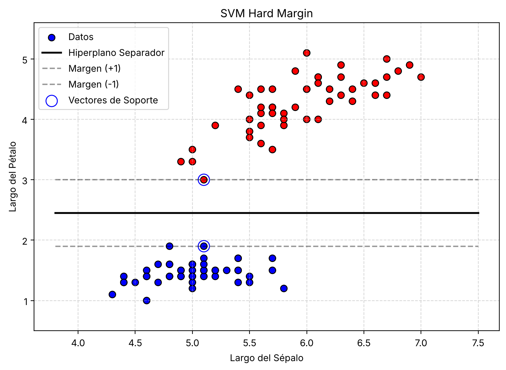

# SVM con kernels cuánticos (QSVM)

Trabajo de Fin de Grado del Grado en Matemáticas, Universidad Complutense de Madrid.

**Autora:** Elia Torres Simón · **Tutor:** Luis Fernando Llana Díaz · **Entrega prevista:** julio de 2027 (trabajo en curso)

> **In English.** Bachelor's thesis in Mathematics (Complutense University of Madrid) on *quantum kernel methods*: support vector machines whose kernel is estimated on a quantum computer, following Havlíček et al. (Nature, 2019). The repository contains my own SVM implementations (primal soft-margin by subgradient descent, and the hard-margin dual solved with SLSQP, checked against scikit-learn), Qiskit notebooks verifying the quantum-computing results the thesis relies on (including a first fidelity-kernel estimate), and my study notes in LaTeX. Next steps: a soft-margin kernel SVM, a quantum kernel built with `ZZFeatureMap`, and experiments on shot noise and exponential concentration. The documentation is in Spanish.

## La idea

Una SVM solo necesita productos escalares entre los datos, es decir, un *kernel*. Un ordenador cuántico de $n$ qubits calcula de forma natural productos internos entre estados de un espacio de Hilbert de dimensión $2^n$. El método de kernel cuántico (Havlíček et al., 2019) consiste en:

1. **Codificar** cada dato $x$ en un estado cuántico $|\phi(x)\rangle = U(x)|0\cdots0\rangle$ mediante un circuito.
2. **Estimar el kernel** $K(x, y) = |\langle\phi(x)|\phi(y)\rangle|^2$ con un circuito: aplicar $U(y)$, después $U(x)^\dagger$, y medir. La probabilidad de obtener $0\cdots0$ es exactamente $K(x, y)$.
3. **Resolver la SVM dual** con esa matriz de kernel. La optimización sigue siendo clásica y convexa.

El objetivo es implementarlo de principio a fin, compararlo con kernels clásicos (lineal, RBF), demostrar que el kernel cuántico es semidefinido positivo y estudiar sus limitaciones: el error por número finito de disparos y la concentración exponencial.

## Resultados hasta ahora

**SVM de margen duro por la vía dual** (`svm/svm_dual.py`, Iris Setosa frente a Versicolor, con el largo del sépalo y el del pétalo). El dual se resuelve con SLSQP imponiendo $\alpha_i \ge 0$ y $\sum_i \alpha_i y_i = 0$. Salen 2 vectores de soporte, con largo del pétalo 1.9 y 3.0, y la solución es $w = (0,\ 20/11) \approx (0,\ 1.818)$, $b = -49/11 \approx -4.455$: la frontera es la recta "largo del pétalo $= 2.45$", justo a mitad de los dos vectores de soporte, y el ancho del margen es $2/\lVert w\rVert = 1.1 = 3.0 - 1.9$. El script comprueba las condiciones KKT ($\sum_i \alpha_i y_i \approx 10^{-14}$, $\min_i y_i(w^Tx_i + b) = 1.0000$) y `sklearn.svm.SVC` con kernel lineal y $C = 10^6$ da la misma frontera ($w \approx (0.001,\ 1.818)$, $b \approx -4.460$).

<p align="center">
  
</p>

**Primer kernel cuántico** (`notebooks/qiskit_leccion3.ipynb`, experimento 8). Con la codificación de un qubit $|\phi(x)\rangle = R_y(x)|0\rangle$, el kernel exacto para $x = 0.3$, $y = 1.2$ es $\cos^2\frac{x-y}{2} = 0.8108$; el circuito de estimación con 10 000 disparos da 0.8143 en la ejecución guardada en el notebook, dentro del error típico $\sqrt{K(1-K)/N} \approx 0.004$.

## Estructura del repositorio

```
├── svm/
│   ├── svm_primal.py         SVM lineal de margen suave, primal, descenso de subgradiente (billetes)
│   └── svm_dual.py           SVM lineal de margen duro, dual con SLSQP (Iris)
├── notebooks/
│   ├── qiskit_leccion1.ipynb Sistemas individuales: regla de Born, fase global, interferencia
│   ├── qiskit_leccion2.ipynb Sistemas múltiples: producto tensorial, entrelazamiento, estados de Bell
│   └── qiskit_leccion3.ipynb Circuitos: medición, no clonación y estimación de un kernel cuántico
├── apuntes/
│   ├── cuaderno_cuantica/    Apuntes de computación cuántica (LaTeX, PDF de 105 páginas y figuras)
│   └── cuaderno_tfg/         Cuaderno de investigación: teoría de SVM, kernels y hoja de ruta
├── datos/
│   └── billetes.csv          Banknote Authentication (UCI); fuente y licencia en datos/README.md
├── requirements.txt
└── LICENSE
```

Los notebooks guardan sus figuras en `apuntes/cuaderno_cuantica/` y los scripts de SVM en `apuntes/cuaderno_tfg/`, que es donde las usan los documentos LaTeX.

## Cómo ejecutarlo

Con Python 3.9 o posterior:

```bash
python -m venv .venv
source .venv/bin/activate
pip install -r requirements.txt

python svm/svm_primal.py      # margen suave, primal
python svm/svm_dual.py        # margen duro, dual
jupyter notebook notebooks/   # experimentos en Qiskit
```

Probado con Python 3.9 y Qiskit 2.2.3. Los PDF de `apuntes/` se compilan con `pdflatex` (el cuaderno de cuántica usa `quantikz` para los circuitos).

## Estado

- [x] Teoría de SVM: primal, dual, KKT, kernels, margen suave
- [x] SVM primal de margen suave (subgradiente) y dual de margen duro (SLSQP)
- [x] Fundamentos de computación cuántica: un sistema, varios sistemas, circuitos
- [x] Experimentos en Qiskit, incluida la estimación de un kernel sencillo
- [ ] Dual de margen suave con kernel genérico, validado contra `sklearn.svm.SVC`
- [ ] Kernel cuántico con `ZZFeatureMap`, demostración de que es semidefinido positivo y QSVM completa
- [ ] Experimentos comparativos (lineal, RBF, cuántico), efecto de los disparos y concentración

## Referencias principales

- P. Rebentrost, M. Mohseni y S. Lloyd, *Quantum support vector machine for big data classification*, Phys. Rev. Lett. 113, 130503 (2014).
- V. Havlíček et al., *Supervised learning with quantum-enhanced feature spaces*, Nature 567, 209–212 (2019).
- M. Schuld y N. Killoran, *Quantum machine learning in feature Hilbert spaces*, Phys. Rev. Lett. 122, 040504 (2019).
- Y. Liu, S. Arunachalam y K. Temme, *A rigorous and robust quantum speed-up in supervised machine learning*, Nature Physics 17, 1013–1017 (2021).
- S. Thanasilp, S. Wang, M. Cerezo y Z. Holmes, *Exponential concentration in quantum kernel methods*, Nature Communications 15, 5200 (2024).
- J. Watrous, *Understanding Quantum Information and Computation*, IBM Quantum Learning.

## Licencia

El código (`svm/` y `notebooks/`) se distribuye bajo licencia MIT (ver [`LICENSE`](LICENSE)). Los apuntes de `apuntes/` son material propio de estudio, basado en el curso de J. Watrous citado arriba; © Elia Torres Simón, todos los derechos reservados. Los datos de `datos/` conservan su licencia original (CC BY 4.0).
